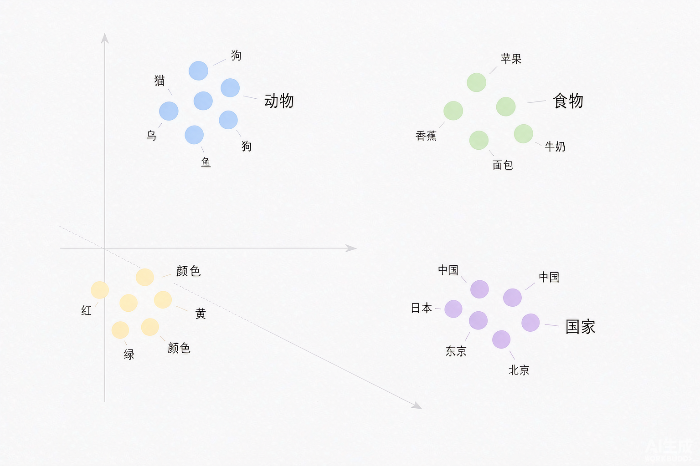
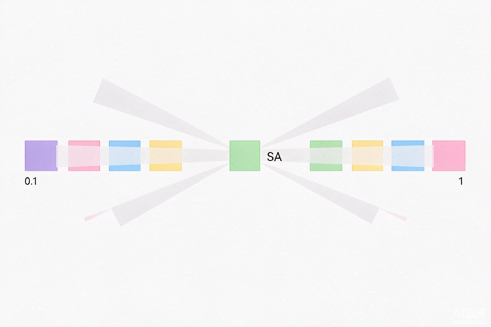
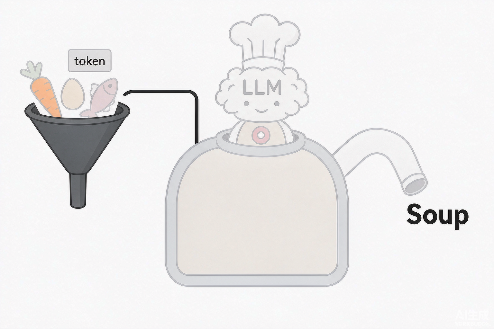
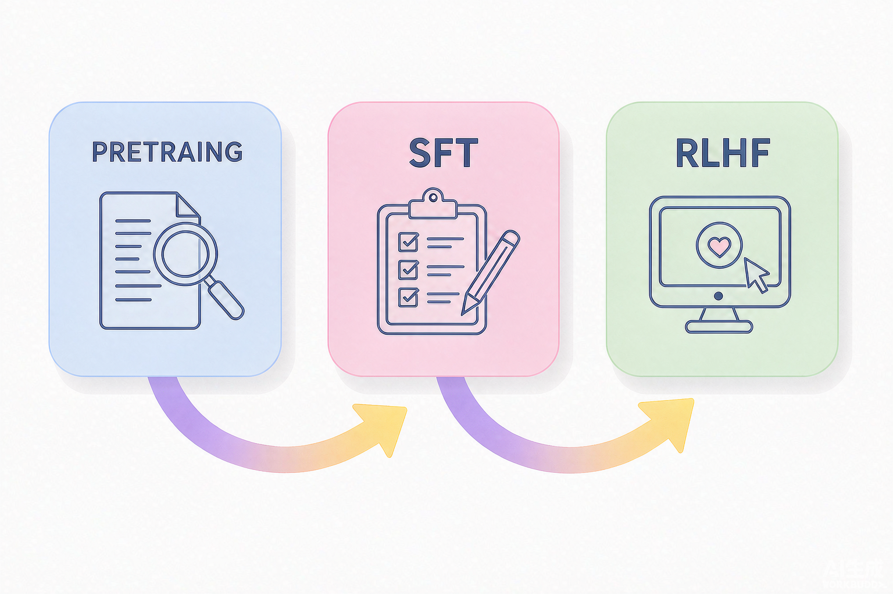

# 大语言模型核心原理

> **适用人群**：有测试开发 / 自动化测试经验，正在系统学习 AI 知识的工程师。
> **学习方式**：每个知识点采用「由浅入深」的引导式讲解——先用生活化比喻建立直觉，再逐步深入到数学与原理层面。
> **配套示意图**：文中穿插 5 张简易教学图，帮助直观理解关键概念。
> **建议节奏**：按章节顺序学习，工作日每天 1 节，周末集中回顾 2-3 节。

---

## 目录

- [第 1 章 大语言模型和传统机器学习的差异](#第-1-章-大语言模型和传统机器学习的差异)
- [第 2 章 大模型的底层 Transformer 架构](#第-2-章-大模型的底层-transformer-架构)
  - 2.1 为什么会用到 Transformer？
  - 2.2 RNN 的原理与局限性
  - 2.3 什么是 Transformer？
  - 2.4 Transformer 架构分析
  - 2.5 Transformer 论文解读
- [第 3 章 大模型运行的基本机制](#第-3-章-大模型运行的基本机制)
  - 3.1 大模型如何理解和表示词
  - 3.2 词向量与词嵌入详解
  - 3.3 大模型如何理解并预测输入内容
- [第 4 章 预训练、SFT、RLHF](#第-4-章-预训练sftrlhf)
  - 4.1 机器学习算法分类
  - 4.2 大模型预训练流程解读
  - 4.3 SFT（监督微调）流程解读
  - 4.4 RLHF（基于人类反馈的强化学习）流程解读
- [总结与面试考点速览](#总结与面试考点速览)

---

## 第 1 章 大语言模型和传统机器学习的差异

### 1.1 先用一个比喻找到感觉

传统机器学习（Machine Learning，ML）就像**教一个学生解题**——你给它**已标注好的标准答案**（比如"这张图片是猫"），它通过大量"标准答案"反复训练，最后学会**分类与预测**。

大语言模型（Large Language Model，LLM）则像**让一个孩子泡在图书的海洋里读书**——它没有被告知"这句话什么意思、那句话对不对"，而是**在海量文本里自己观察语言的规律**，最终学会了**"接着往下写"**的能力。

| 对比维度 | 传统机器学习 | 大语言模型 |
|---------|------------|-----------|
| **核心任务** | 分类、回归、预测（有明确标签） | 语言生成（预测下一个词 / Token） |
| **数据依赖** | 需要大量**人工标注**的数据 | 只需要**海量原始文本**（互联网语料） |
| **训练范式** | 监督学习为主 | 自监督学习为主（无需标签） |
| **通用性** | 一个模型解决**单一任务**（如只做图像识别） | 一个模型**泛化**到翻译、问答、写作、编码等多种任务 |
| **规模** | 参数量从几千到几亿 | 参数量从几十亿到数万亿 |
| **输出** | 类别标签 / 数值 | 一段自然的文字序列 |

> **一句话总结**：传统 ML 是"**喂答案**"，LLM 是"**喂语料、自学语言**"。LLM 的厉害之处在于——它学会的不是某个具体任务，而是**"语言本身"**这个通用能力。

### 1.2 为什么 LLM 能"无所不能"？

关键在于 LLM 抓住了语言的一个核心规律：

> **预测下一个词（Next Token Prediction）**

当你看到"今天天气真___"，模型知道"好""棒"的概率比"桌子"高得多。如果能**从海量文本中学会"哪个词最可能接在哪个词后面"**，那么只要给定一个开头，模型就能**一个字一个字地"续写"**下去——这就是生成能力的本质。

**理解要点**：
- LLM 本质上是一个**极其强大的"概率模型"**：给定前文，预测下一个词的概率分布。
- 它**不知道"真理"**，它只知道"**语言统计规律**"。所以有时会"一本正经地胡说八道"（幻觉，hallucination）。
- 传统 ML 解决单一任务；LLM 通过"下一个词预测"这个**统一的预训练目标**，意外地学到了丰富的世界知识与推理能力（涌现能力，emergent ability）。

**给测试工程师的启示**：正因为 LLM 是"概率生成器"，所以 AI 测试的核心难点在于 —— **输出具有不确定性与多样性**，不能像传统接口测试那样断言"返回 == 期望值"，而要用**评测（eval）**来验证质量。

---

## 第 2 章 大模型的底层 Transformer 架构

> 🔑 **本章是全篇的核心**。Transformer 是让大模型"跑起来"的底层引擎。我们从"为什么需要它"开始，由浅入深。

### 2.1 为什么会用到 Transformer？

要理解"为什么"，先要知道**它之前的方案有什么问题**。

在 Transformer 出现之前，处理序列数据（文字、语音）的主流方案是 **RNN（循环神经网络，Recurrent Neural Network）**。但 RNN 有两个致命的局限，直接催生了 Transformer 的诞生。

### 2.2 RNN 的原理与局限性

#### （1）RNN 的工作原理：像"接力读句子"

RNN 处理文字是**逐个词读**的：每读一个词，就把"上一个词留下的记忆"和"当前词"结合起来，更新一份"新记忆"，再传给下一个时间步。

```
我 → (记忆1) → 爱 → (记忆2) → 北京 → (记忆3) → ...
```

想象你**一字一句地读一句话，且必须读完前一个词才能读后一个**。这就是 RNN 的串行特性。

#### （2）RNN 的两大局限

| 局限 | 比喻 | 本质问题 |
|------|------|---------|
| **① 串行计算，速度慢** | 只能一个字一个字读，不能同时读 | 训练时无法并行，遇到超大数据集效率极低 |
| **② 长距离依赖丢失** | 读到句子末尾，容易忘了句首的内容 | 梯度消失/梯度爆炸，模型"记不住"较远的信息 |

**长距离依赖**的例子：句子"我昨天在公园遇到了一只**猫**，它特别可爱，我忍不住摸了一下它的___"，要正确填"头"，模型必须记得前面几百个字之外的"**猫**"。RNN 很难做到，因为信息在漫长的传递中会"衰减"。

> **Transformer 的诞生动机**：既要**并行计算**（解决速度），又要**记住长距离依赖**（解决记忆）。于是，**注意力机制（Attention）** 登场了。

### 2.3 什么是 Transformer？

**Transformer** 是一种**基于注意力机制（Attention）的神经网络架构**，由 Google 在 2017 年发表的论文 **《Attention Is All You Need》** 中提出。

它的核心思路可以这样理解：

> **不再是"接力读"，而是"一眼看全 + 重点关注"**。

当模型处理一句话时，它**同时看到所有词**，并能动态判断**哪些词之间关系最紧密**（比如"猫"和"摸"之间应该建立强关联——摸的对象是猫），从而突破 RNN 的长距离依赖与串行限制。

**关键特性**：
- ✅ **并行化**：所有词同时处理，训练速度快。
- ✅ **长距离依赖**：任意两个词之间都能直接建立关联。
- ✅ **可扩展**：堆叠层数 + 增加参数量 → 模型变大 → 能力变强（这就是"大"模型的由来）。

### 2.4 Transformer 架构分析

一张经典完整的编码器-解码器结构图（**出处：Vaswani et al.,《Attention Is All You Need》(2017) 论文图 1**，为你直接从论文提取的高清原图）：


**Transformer 整体由两大部分组成**：

#### （1）Encoder（编码器）—— 负责"读懂输入"

- 作用：把输入的句子（如"我今天很开心"）**编码成一串包含语义信息的向量**。
- 过程：输入 → 词嵌入 → 多头自注意力 → 前馈网络 → 输出编码向量。
- 图中左侧黄色堆叠块即 Encoder，可堆叠 `Nx` 层。

#### （2）Decoder（解码器）—— 负责"生成输出"

- 作用：根据编码器给的"语义"，**一步步生成目标文字**（如翻译成英文）。
- 过程：输入已生成的部分 → 掩码自注意力 → 交叉注意力（与编码器交互）→ 前馈网络 → 输出下一个词。
- 图中右侧绿/紫堆叠块即 Decoder，输出 `Y`。

> **打个比方**：Encoder 是"**阅读理解**"——把整篇文章看懂并提炼成要点；Decoder 是"**复述写作**"——基于要点，一个字一个字地把答案写出来。

#### 核心组件速览表

| 组件 | 作用 | 生活化比喻 |
|------|------|-----------|
| 词嵌入（Embedding） | 把词变成数字向量 | 给每个词发一张"身份证号" |
| 位置编码（Positional Encoding） | 告诉模型词的前后顺序 | 给每个词标上"第几个出场" |
| 多头自注意力（Multi-Head Self-Attention） | 计算词与词之间的关联强度 | 在一句话里找出"谁和谁关系密切" |
| 前馈网络（Feed-Forward Network） | 对每个词做进一步特征变换 | 对每个理解进行"消化加工" |
| 残差连接 + 层归一化 | 让深层网络稳定训练 | 给高层建筑加"电梯和地基" |

### 2.5 Transformer 论文解读

> 核心论文：**《Attention Is All You Need》**（Vaswani et al., 2017）。标题直译"**注意力就是你需要的一切**"，一句话点明：**不再需要 RNN，注意力机制就够了**。

#### 论文的三大核心贡献

1. **提出注意力机制（Attention）**：取代 RNN 的循环结构，使词与词之间能够"直接对话"，解决长距离依赖。
2. **多头注意力（Multi-Head Attention）**：让模型能从多个不同的"视角"理解句子（好比同一件事，既看"是谁做的"，也看"做了啥"，还看"在哪做的"）。
3. **完全并行化**：摆脱串行循环，大规模并行训练成为可能，为后来"大"模型的诞生铺平道路。

#### 论文里的关键公式直觉

注意力机制的核心是一个"**加权平均**"：

> **Attention(Q, K, V) = softmax( Q·Kᵀ / √d ) · V**

拆开理解（一个生动的"查资料"比喻）：
- **Q（Query，查询）**：我在找什么？（"猫摸到了什么？"）
- **K（Key，键）**：每个候选资料的"标签"。（每个词的标签）
- **V（Value，值）**：每个候选资料"真正的内容"。（每个词的语义向量）
- **Q·K**：算"我的问题和每个词有多匹配"（匹配度得分）
- **softmax**：把得分转成"注意力权重"（概率）
- **×V**：按权重把各个词的内容加权汇总成"最贴合当前语境的理解"

**通俗讲**：你要查"猫摸了啥"，系统看每个词跟"猫"有多相关——"头"很相关（权重高）、"昨天"不太相关（权重低）——最后加权取"头"的信息，就得到了答案。

---

## 第 3 章 大模型运行的基本机制

> 🔑 理解了架构后，这一章讲"**大模型到底怎么用**"——它如何把文字变成数字（表示），又如何根据语义生成文字（预测）。

### 3.1 大模型如何理解和表示词

#### 3.1.1 大模型的处理单元——Token

计算机不懂"汉字"或"英文单词"，它只懂数字。所以大模型的第一步，是把文本拆成一个一个的**最小处理单元**，这个单元就叫 **Token（词元 / 标记）**。

| 语言 | 拆分方式 | 例子 |
|------|---------|------|
| 英文 | 常按子词（subword）拆分 | "unhappy" → "un" + "happy" |
| 中文 | 按字 / 词 / 常见子词拆 | "我爱你" → "我" + "爱" + "你" |

**Token 的重要性**：
- 大模型的上下文窗口（context window）以 **Token 数量** 计量（如 128K、1M）。
- 计费也按 Token 计（输入 + 输出）。
- 模型**一次只能"看"和"生成"有限数量的 Token**。

> **给测试同学的提示**：所以接口自动化里做长文本测试、或评估上下文长度，要关注 Token 用量与截断问题。

#### 3.1.2 Token 之间的"远近亲疏"关系

句子里的词**不是孤立的**，它们之间存在**远近亲疏**：

- **语法上的近**：紧挨着的词通常关系紧密，如"很 + 开心"。
- **语义上的近**：即便隔得很远，"猫"和"尾巴"依然有关联。
- **上下文决定亲疏**：同一个词"苹果"在"吃苹果"和"苹果公司"里，语义完全不同。

**Transformer 如何捕捉远近亲疏？**——正是靠**注意力机制**。它不依赖物理位置，而是**动态计算任意两个 Token 之间的关联强度**。距离近的词容易建立高权重，但语义相关的远距离词也能获得高权重。这就是"远近亲疏"的数值化表达。

#### 3.1.3 大模型词义的载体与表现特征

- 词义的**载体**是**向量（Vector）**：一串数字，如 `[0.12, -0.45, 0.88, ...]`。
- **表现特征**：语义相近的词，向量在空间中的**距离也更近**；能在不同维度上体现**相似性 / 类比关系**（如"国王 - 男人 + 女人 ≈ 女王"）。
- 这种"语义映射"，是通过**词嵌入（Word Embedding）** 把词映射到高维数字空间实现的。

### 3.2 词向量与词嵌入详解

#### 3.2.1 什么是词嵌入？

**词嵌入**（Word Embedding）是把单词映射为一个**低维稠密向量**的技术，让计算机能"算"词与词之间的语义关系。

**生活化比喻**：想象一个巨大的**三维空间**（实际是几千维），每个词在这个空间里有一个"坐标点"。**意思相近的词会靠在一起**（猫、狗、鱼聚成"动物"堆），**意思无关的词离得很远**。

下图直观展示：语义相近的词在向量空间中**聚成簇**（动物、食物、颜色、国家各成一群）：



#### 3.2.2 常见向量模型

| 模型 | 年代 | 特点 | 地位 |
|------|------|------|------|
| **Word2Vec** | 2013 | 经典，能捕捉词类比关系（国王-男人+女人=女王） | 词嵌入奠基之作 |
| **GloVe** | 2014 | 基于全局共现统计，效果稳定 | 经典之一 |
| **BERT / GPT 的嵌入层** | 2018+ | **上下文相关**：同一个词在不同句子有不同的向量 | 现代 LLM 的主流方案 |

> **核心进阶点**：早期模型（Word2Vec/GloVe）是**静态词向量**——"苹果"这个词无论在哪都一个向量。而现代 LLM 是**动态（上下文相关）词向量**——"苹果"在"吃苹果"和"苹果公司"里**会被编码成不同的向量**。这正是 LLM 理解力强大的关键之一。

### 3.3 大模型如何理解并预测输入的内容

这一节是"理解 + 生成"的完整闭环。我们从**注意力机制**讲起，逐步深入到模型如何**基于语义生成**。

#### 3.3.1 注意力机制（Attention）

**作用**：让模型在处理某个词时，**聚焦（关注）句子中与它最相关的其他词**，从而理解当前词在具体语境中的含义。

- 你读"他摸了一下**猫**的头"，理解"摸"时，注意力会自然指向"猫"和"头"——这就是注意力在起作用。
- 公式：`Attention = softmax(Q·Kᵀ/√d)·V`（已在上一章详细拆解）。

#### 3.3.2 自注意力机制（Self-Attention）

**自注意力**是注意力机制在**同一个句子内部**的应用——**句子里的每个词都去"看"其他所有词**，判断各自的关联强度。

下图直观展示：句子中某个中心 Token 向句中所有其他 Token 发射"注意力光束"，光束粗细代表关注权重：



**为什么叫"自"注意力？** 因为 Q、K、V 都来自**同一个句子**（自己查自己），而不是跨句子的查询。

> **通俗总结**：自注意力就是让"每个词都问问其他词——你我之间关系大不大？关系大的我多听听你的意见。"这样聚合后的信息，就包含了全句语境。

#### 3.3.3 多头注意力机制（Multi-Head Attention）

一个注意力头只能从一个"角度"看句子，**多头**让模型能**从多个不同角度同时理解**。

- 每个"头"负责一类关系：有的头关注**语法结构**（主语、谓语），有的关注**指代关系**（"它"指什么），有的关注**主题关联**。
- 多个头的结果**拼接**在一起，得到更丰富的语义表示。
- 比喻：同一件事，让 8 个专家从不同角度分析，最后汇总成更全面的结论。

#### 3.3.4 基于语义理解的内容生成（生成过程）

大模型的生成，本质是**逐步预测下一个 Token** 的过程：

```
输入："今天天气真"
   ↓
模型把输入编码成语义向量，再结合注意力理解语境
   ↓
输出：每个候选词的"概率分布"  →  "好"(0.45) "棒"(0.22) "差"(0.03) ...
   ↓
选择概率最高的词（或按采样策略）→ 得到 "好"
   ↓
把生成的结果拼接回输入，继续预测下一个词："今天天气真好___"
```

**关键点**：
- **自回归生成（Autoregressive）**：一个字一个字地往外蹦，每次生成都依赖"之前生成的所有内容"。
- **解码策略**：贪心（选概率最大）/ 采样（按概率随机，增加多样性）/ Top-k、Top-p 等，影响生成结果的**确定性 vs 多样性**。
- **温度（temperature）**：控制随机性。低温 → 更确定保守；高温 → 更发散有创意。

**给测试工程师的实践提示**：生成类用例断言，不能只看"内容是否等于期望"，而要看**语义是否合理**、是否满足**约束**（如 JSON 格式、关键词、长度区间）。可以引入**语义相似度、LLM-as-a-Judge、规则校验**等多层断言策略。

下图总结 LLM 的"输入 Token → 语义理解 → 预测输出"的整体过程：



---

## 第 4 章 预训练、SFT、RLHF

> 🔑 这一章回答核心问题：**一个大模型是怎么"炼"出来的？** 答案是**三阶段流水线**：预训练 → SFT → RLHF。

下图先行总览整个三阶段训练流程：



### 4.1 机器学习算法分类

理解三阶段前，先明确机器学习的基本分类，因为大模型的训练**混合了多种范式**：

| 学习范式 | 数据情况 | 典型场景 | 大模型中的应用 |
|---------|---------|---------|--------------|
| **监督学习（Supervised）** | 输入 + 正确答案（标签） | 分类、回归 | **SFT** 阶段 |
| **无监督/自监督（Unsupervised）** | 只有原始数据，无标签 | 聚类、降维 | **预训练**阶段（预测下一个词） |
| **强化学习（Reinforcement）** | 通过"奖惩"反馈来学习 | 决策、博弈 | **RLHF** 阶段 |

> **一句话**：预训练用**自监督**让模型"识字"；SFT 用**监督学习**让模型"会听话干活"；RLHF 用**强化学习**让模型"符合人的偏好"。

### 4.2 大模型预训练流程解读

**预训练（Pre-training）** 是第一阶段，目标是让模型**学会语言本身**。

#### 训练对象与目标
- **数据**：海量互联网文本（网页、书籍、代码、论文等），约几万亿 Token。
- **任务**：**自监督的"填空/预测下一个词"**（Masked Language Modeling 或 Causal Language Modeling）。
- **产出**：一个"语言能力很强，但还不太会回答问题"的**基座模型（Base Model）**。

#### 训练流程步骤
1. **数据收集与清洗**：抓取海量文本 → 去重、去噪、过滤低质/有害内容。
2. **分词（Tokenization）**：把文本切分成 Token，建立词表。
3. **预训练**：在 GPU 集群上（成百上千张卡）训练数周至数月。
4. **模型产出**：得到一个能续写文本、具备世界知识的基础模型（如 GPT 的 base 版本）。

#### 关键特点
- **计算成本极高**：训练一个千亿参数模型需数百万 GPU 小时。
- **学知识但不一定"听话"**：它能续写，但不懂"用户想问什么、怎么格式回答"，也不安全。于是需要下一阶段。

### 4.3 SFT（监督微调）流程解读

**SFT（Supervised Fine-Tuning，监督微调）** 是第二阶段，目标是让模型**学会"与人类交互"**——即理解指令、按要求的格式回答问题。

#### 训练对象与目标
- **数据**：**人工标注的"指令-回答"对**（Instruction-Answer pairs），例如：
  - 指令："请用一句话解释什么是 RAG。"
  - 回答："RAG 是检索增强生成，……"
- **任务**：**监督学习**——让模型学会"看到指令，输出对应的规范回答"。
- **产出**：一个**指令跟随模型（Instruct Model / Chat Model）**，如 ChatGPT 的对话版本、DeepSeek-Chat。

#### 训练流程步骤
1. **构建指令数据集**：收集真实用户问题，由人类（或更强的模型）撰写高质量回答。
2. **数据质量筛选**：去重、过滤有害、保证多样性。
3. **微调训练**：用这些"问题-标准答案"对，在预训练模型基础上继续训练（比预训练快很多，成本低）。

#### 关键特点
- **成本远低于预训练**，通常几百到几万条高质量指令即可显著改善"听话度"。
- **从"会语言"到"会干活"**：决定模型是"聪明的聊天助手"还是"只会续写的机器"。
- 训练数据质量**对最终效果影响极大**——"垃圾进，垃圾出"。

### 4.4 RLHF（基于人类反馈的强化学习）流程解读

**RLHF（Reinforcement Learning from Human Feedback，基于人类反馈的强化学习）** 是第三阶段（也是让模型"从好到更好"的精细化阶段），目标是让模型**对齐人类偏好**——更安全、更有用、更符合人类价值观。

> ChatGPT 之所以比 GPT-3 好用很多，**关键一步就是 RLHF**。

#### 核心思想
前两阶段，模型只是"学着像人一样写"。RLHF 则引入**人类真正喜欢什么**的信号，通过强化学习**纠正偏好**。

#### RLHF 三步骤流程

**Step 1：收集人类反馈，训练奖励模型（Reward Model, RM）**
- 让模型对同一个问题生成**多个回答**。
- 请人类根据"有用性、安全性、诚实度"给这些回答**打分排序**（A 比 B 好，B 比 C 好）。
- 用这些排序数据训练一个**奖励模型**：给它一个回答，它能**预测"人类会打多少分"**。

**Step 2：用奖励模型做强化学习（如 PPO）**
- 让策略模型（正在训练的大模型）生成回答。
- 奖励模型给这个回答打分，作为"奖励"。
- 通过 **PPO（Proximal Policy Optimization）** 等强化学习算法，**优化模型参数**，让模型**更倾向于生成高奖励（人类更喜欢）的回答**。
- 同时加一个" KL 惩罚项"，防止模型为了讨好奖励模型而跑偏、偏离理想分布。

**Step 3：迭代优化**
- 反复采集反馈、重训奖励模型、重训策略模型，持续提升对齐度。

#### 为什么需要 RLHF？
| 目的 | 说明 |
|------|------|
| **有用性** | 让模型更愿意给出**有帮助**、贴合用户意图的回答 |
| **安全性** | 减少有害、偏见、不当内容 |
| **诚实性** | 降低幻觉，减少"不懂装懂" |
| **对齐（Alignment）** | 让模型行为符合**人类价值观与偏好** |

#### 三阶段对比总结表

| 阶段 | 全称 | 学习范式 | 数据 | 目标 | 比喻 |
|------|------|---------|------|------|------|
| ① 预训练 | Pre-training | 自监督 | 海量文本 | 学会语言 & 世界知识 | "识字、博览群书" |
| ② SFT | Supervised Fine-Tuning | 监督 | 指令-回答对 | 学会听指令、按格式回答 | "学会答题规范" |
| ③ RLHF | RL from Human Feedback | 强化 | 人类偏好排序 | 让回答更安全、有用、对齐价值观 | "学会讨人喜欢、守规矩" |

> **给测试工程师的实践提示**：理解这三阶段，有助于你设计 AI 产品测试用例——**预训练**阶段关注知识与能力、**SFT** 阶段关注指令遵循与格式、**RLHF** 阶段关注安全性与偏好对齐。这三类测试各有侧重，是 AI 评测（eval）的重要分层。

---

## 总结与面试考点速览

### 全篇知识体系一图流

| 章节 | 核心问题 | 一句话答案 |
|------|---------|-----------|
| 第 1 章 | LLM 与传统 ML 有何不同？ | 传统 ML"喂答案"，LLM"喂语料自学下一个词" |
| 第 2 章 | 底层架构是什么？ | Transformer：注意力机制取代 RNN，并行 + 长距离依赖 |
| 第 3 章 | 如何理解与生成？ | Token 切分 → 词嵌入成向量 → 自注意力/多头注意力建模语义 → 逐词预测生成 |
| 第 4 章 | 如何"炼"出来？ | 预训练（识字）→ SFT（听话）→ RLHF（对齐偏好） |

### 高频面试考点（对标 17-22K AI 测试岗）

1. **能解释 Transformer 为什么替代 RNN**（并行 + 长距离依赖 + 可扩展）。
2. **能讲清自注意力 vs 多头注意力的区别**。
3. **能解释 Token 与词嵌入的关系**，以及静态 vs 上下文相关向量。
4. **能说清预训练 / SFT / RLHF 三阶段各自的目标、数据、范式**。
5. **能结合 AI 测试的视角**说明：为什么 LLM 输出不确定 → 需要评测（eval）而非传统断言。

### 延伸学习方向
- RAG 检索增强生成（如何在生成前"查资料"）
- Agent 架构（如何让大模型"会调用工具、规划行动"）
- Eval 评测体系（如何科学地衡量大模型输出质量）

---

> 📝 **配套图片说明**：本文件引用的图片位于同级 `images/` 目录——
> - **Transformer 架构图**：取自论文原生高清原图（`transformer_architecture_paper.png`），完整呈现 Encoder/Decoder、多头注意力、Add & Norm、位置编码、Softmax 等全部结构。
> - 其余 4 张（词向量语义聚类、自注意力机制、LLM 预测机制、预训练-SFT-RLHF 三阶段流程）为教学示意。
