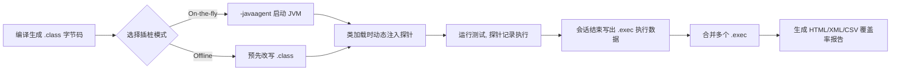
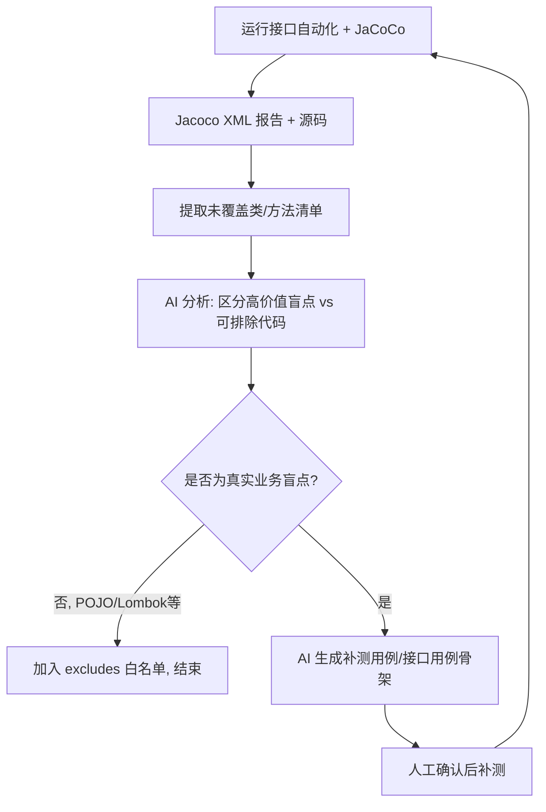

# JaCoCo 代码覆盖率工具：从入门到工程落地

> **一句话概括**：**JaCoCo**（Java Code Coverage，Java 代码覆盖率）是一套开源的 Java 代码覆盖率统计工具，它在运行测试的同时「偷偷记录」哪些代码被执行到了、哪些没有，最后统计成可视化报告。

> **类比（面向测试同学）**：JaCoCo 之于 Java，相当于 `coverage.py` / `pytest-cov` 之于 Python。你写 pytest 时用 `pytest --cov=my_pkg` 看覆盖率，JaCoCo 在 Java 世界里干的就是这件事，只是维度更细、和 JVM 结合更深。

**来源**：`.raw/测试开发相关学习资料/JaCoCo代码覆盖率工具从入门到工程落地.md`（2026-08-28）
**定位**：零基础 → 实践 → 工程落地，面向 SDET（已有 pytest / 接口自动化 / 测试平台经验，正向 AI 测试进阶）

---

## 第一阶段：基础入门

### 1.1 JaCoCo 解决什么问题

| 问题 | JaCoCo 如何解决 |
|------|----------------|
| **不知道测试覆盖了哪些代码** | 运行时插桩，精确记录每个方法、每行、每个分支是否被执行 |
| **测试存在盲区却无法量化** | 用覆盖率数字 + 高亮报告，直观暴露「未覆盖（红色）」区域 |
| **回归不敢改代码** | 覆盖率作为门禁，低于阈值就阻断合并，防止「改了但没测到」 |
| **版本间覆盖退化无感知** | 每次构建生成报告并归档，可横向对比覆盖率趋势 |
| **测试多余（重复执行）无法发现** | 结合增量覆盖率，识别「写了用例但实际没覆盖新增代码」 |

**JaCoCo 做不到 / 不应过度期待的点（面试常考，务必说清边界）**：

1. **覆盖率不等于质量**：100% 覆盖 ≠ 测试得好。一行 `assertTrue(true)` 就能「执行」很多代码，但验证价值为 0。
2. **不测业务正确性**：它只记录「执行到没执行到」，不关心断言是否合理、结果是否正确。
3. **无法替代测试设计**：是否覆盖了异常分支、边界值、并发场景，仍需靠测试设计补齐。

### 1.2 核心用途与适用场景

| 用途 | 适用场景 | 说明 |
|------|----------|------|
| 单元测试覆盖率 | 单模块/单服务的 `mvn test` | 最常见、最基础 |
| 接口/自动化测试覆盖率 | 集成测试、`@SpringBootTest` / TestNG / 自研接口测试框架 | 衡量端到端接口测试有多少代码被执行 |
| CI 覆盖率门禁 | Jenkins / GitLab CI / GitHub Actions | `check` goal 配合规则，低于阈值构建失败 |
| 增量覆盖率分析 | 依赖 Git diff 的第三方插件（如 `jacoco-diff`） | 只看本次改动新增/修改代码的覆盖情况 |
| 远程环境采集 | SIT / 预发环境无人值守采集 | 通过 `tcpclient` + `dump` 远程拉取数据 |

> **面向测试同学的落地指向（本文核心）**：把 JaCoCo 作为「接口自动化测试的覆盖度量仪表盘」——接口用例跑完后，哪些 Controller / Service / DAO 代码没被触达，一眼看出测试盲点，再反哺补测用例。

### 1.3 插桩机制原理

**插桩（Instrumentation）** 是 JaCoCo 的核心：在程序运行时，往 Java 字节码（bytecode）中插入「探针（probe）」，探针用布尔数组 `boolean[]` 记录某段代码是否被执行。

| 模式 | 何时插桩 | 侵入方式 | 典型场景 |
|------|----------|----------|----------|
| **On-the-fly 运行时插桩** | 测试 JVM 启动时（`-javaagent`） | Java 代理（agent）动态改写类 | 单元测试、`jacoco-maven-plugin` 默认 |
| **Offline 离线插桩** | 编译之后、运行之前 | 直接改写 `.class` 文件 | Android、OSGi、无法挂 agent 的环境 |
| **Server/Client 远程模式** | 运行时 + 网络传输 | agent 开 TCP 端口服务，`dump` 拉取 | 远程/无人值守环境采集 |

> **重点理解 On-the-fly**：JaCoCo 通过 JVM 的 `-javaagent` 机制在类加载（class loading）阶段挂钩，把探针注入进每个类后才交给 JVM 实际执行。探针只做一件事——当执行流经过时把对应下标的 `boolean` 置为 `true`，开销极小。



### 1.4 覆盖率维度详解（5 大核心维度）

| 维度 | 英文 | 含义 | 通俗解释 |
|------|------|------|----------|
| 指令 | Instructions | 已执行字节码指令 / 总字节码指令 | 最细粒度，衡量「代码到底跑了多少」 |
| 分支 | Branches | 已覆盖分支 / 总分支（`if`、`switch`、三元等） | 判断逻辑的分叉有没有都走到 |
| 行 | Lines | 已执行行 / 总行 | 用户最直观的「代码行覆盖率」 |
| 类 | Classes | 已覆盖类 / 总类 | 有没有整个类都没被触达 |
| 方法 | Methods | 已覆盖方法 / 总方法 | 有没有整个方法都没被调用 |

**各维度要点与关系**：

1. **指令（Instructions）** 是 JaCoCo 内部的统计基础，行覆盖、分支覆盖均由指令执行数据推导而来。它是「最不会骗人」的指标，也是 CI 门禁里常用的 `COVEREDRATIO`。
2. **分支（Branches）** 最容易「拉低总分」：一个 `if (a && b)` 逻辑上可能有多个分支，测试往往难以穷举，所以分支覆盖率常是最先拖后腿的那一项。
3. **行（Lines）** 直观但**会高估**：一行里写了多个语句，只要执行到其中一句整行就算 covered。因此**行覆盖率通常高于指令和分支覆盖率**。
4. **类/方法** 用来快速定位「整块代码从没被碰过」的模块，而不是细粒度追踪。

### 1.5 覆盖率报告怎么读

三类报告：**HTML**（可视化，最常用）、**XML**（供 CI 解析）、**CSV**（供脚本/表格处理）。读到源码页面时，重点看**行高亮颜色**：

| 颜色 | 含义 |
|------|------|
| 🟩 绿色 | 该行被执行过（fully covered） |
| 🟨 黄色 | 该行被部分执行（如分支只走了一半） |
| 🟥 红色 | 该行未被执行（未覆盖） |

> **面试表达模板**：「看 JaCoCo 报告，我首先看指令和分支覆盖率这两个硬指标，再钻取到红色高亮的类和方法，定位本次接口测试没触达的 Controller/Service 分支，最后结合红色区域设计补测用例。」

---

## 第二阶段：实践应用

> 以下以 **Maven + Spring Boot** 为主示例（Java 生态最常见配置）。Gradle、TestNG、Ant 配置思路一致，仅写法不同。

### 2.1 集成单元测试

核心插件：`org.jacoco:jacoco-maven-plugin`

```xml
<plugin>
    <groupId>org.jacoco</groupId>
    <artifactId>jacoco-maven-plugin</artifactId>
    <version>0.8.12</version>
    <executions>
        <!-- 1) prepare-agent：在测试 JVM 启动前挂上 JaCoCo agent -->
        <execution>
            <id>prepare-agent</id>
            <goals><goal>prepare-agent</goal></goals>
        </execution>
        <!-- 2) report：测试结束后根据 .exec 数据生成报告 -->
        <execution>
            <id>report</id>
            <phase>test</phase>
            <goals><goal>report</goal></goals>
        </execution>
    </executions>
</plugin>
```

**关键步骤解读**：

1. **`prepare-agent`**：在 Surefire（Maven 测试插件）启动前，把 `-javaagent:jacocoagent.jar` 参数注入到测试 JVM。`argLine` 属性因此被自动填充——**这是最容易踩坑的点**。
2. **`report`**：读取 `target/jacoco.exec` 执行数据，结合源码与 class 生成 HTML/XML/CSV 报告到 `target/site/jacoco/`。

```bash
mvn clean test
# 报告位置：target/site/jacoco/index.html
```

### 2.2 集成自动化测试

**核心问题**：接口自动化测试的进程**通常和被测应用是分开的**（不是一个 JVM），所以不能再靠「同一 JVM 里挂 agent」简单实现。两种思路：

| 方案 | 说明 | 适用场景 |
|------|------|----------|
| **方案 A：测试与被测同进程** | 用 `@SpringBootTest` / 嵌入容器启动应用，在同一 JVM 直接测 | 微服务单测、`MockMvc` 接口测试 |
| **方案 B：远程 Server 模式** | 被测应用以 agent 的 TCP server 模式启动，测试进程结束后用 `dump` 拉取数据 | SIT/预发环境、真实对外接口的端到端采集 |

```java
@SpringBootTest
@AutoConfigureMockMvc
class OrderControllerTest {
    @Autowired
    private MockMvc mockMvc;

    @Test
    void shouldReturnOrder() throws Exception {
        mockMvc.perform(get("/api/orders/1"))
               .andExpect(status().isOk())
               .andExpect(jsonPath("$.id").value(1));
    }
}
```

> 面向测试同学的关键词：你已有的 **pytest + requests 接口自动化**本质是「黑盒进程外测试」。要接 JaCoCo，标准做法是让**被测 Java 服务**以 agent server 模式启动，测试跑完后 `dump` 一次；这与你熟悉的「抓包/脚本执行完再汇总」思路一致，只是「汇总」发生在 Java 服务侧。

### 2.3 解读覆盖率报告（通用建议）

1. **先看汇总，再看钻取**：首页确认指令/分支/行总量与百分比，再进入红色高亮的类。
2. **分支优先于行**：行覆盖容易「虚高」，分支覆盖更能反映逻辑是否被充分验证。
3. **关注「未覆盖的方法」而非「未覆盖的单行」**：整块业务方法缺失，才是测试盲点。
4. **排除不必要覆盖的代码**：`@Data`（Lombok）、getter/setter、常量类、纯 POJO、配置类应通过 `excludes` 排除，避免「为了凑数字」写无效测试。

### 2.4 CI/CD 中的覆盖率阈值与失败门禁

**门禁（Quality Gate）** = 在 CI 里「报告生成后强制校验覆盖率，不达标就失败」。核心是 **`check` goal + `rules` 规则**：

```xml
<execution>
    <id>check</id>
    <goals><goal>check</goal></goals>
    <configuration>
        <rules>
            <!-- 包粒度的全局规则 -->
            <rule>
                <element>BUNDLE</element>
                <limits>
                    <limit>
                        <counter>INSTRUCTION</counter>
                        <value>COVEREDRATIO</value>
                        <minimum>0.80</minimum>
                    </limit>
                    <limit>
                        <counter>BRANCH</counter>
                        <value>COVEREDRATIO</value>
                        <minimum>0.60</minimum>
                    </limit>
                </limits>
            </rule>
            <!-- 关键核心包单独提高要求 -->
            <rule>
                <element>PACKAGE</element>
                <includes>
                    <include>com.example.order.service.*</include>
                </includes>
                <limits>
                    <limit>
                        <counter>LINE</counter>
                        <value>COVEREDRATIO</value>
                        <minimum>0.90</minimum>
                    </limit>
                </limits>
            </rule>
        </rules>
    </configuration>
</execution>
```

**`counter` 类型起步建议值**：

| counter | 说明 | 起步建议值 |
|---------|------|-----------|
| `INSTRUCTION` | 指令覆盖率 | ≥ 80% |
| `BRANCH` | 分支覆盖率 | ≥ 60% |
| `LINE` | 行覆盖率 | ≥ 80% |
| `CLASS` / `METHOD` | 类 / 方法覆盖率 | ≥ 90%（快速发现整块缺失） |

**Jenkins 侧做法**：

```bash
mvn clean test org.jacoco:jacoco-maven-plugin:0.8.12:check
# 后续用 "Publish Jacoco Coverage Report" 发布覆盖率报告
```

```groovy
stage('Test & Coverage') {
    steps {
        sh 'mvn clean test org.jacoco:jacoco-maven-plugin:0.8.12:check'
    }
    post {
        success {
            jacoco execPattern: '**/target/*.exec', sourcePattern: '**/src/main/java'
        }
    }
}
```

**设置门禁的黄金原则**：

1. **从现状出发，逐步抬高**：先测当前覆盖基线（比如 45%），设定「不低于现状」起步，再逐步加码。
2. **只卡总包 + 关键包**：对核心业务包卡严，对 POJO/Lombok 放行并 `excludes`。
3. **区分「新增代码」与「存量代码」**：存量代码很难短期达标，强烈建议引入「增量覆盖率」只卡本次改动（Git diff），配合 `jacoco-diff` 类工具。

### 2.5 报告生成与归档

| 方式 | 做法 |
|------|------|
| Jenkins 插件归档 | `jacoco` 步骤自动归档报表，构建页可查看 |
| 文件静态托管 | 把 `target/site/jacoco/` 上传到制品库（Nexus/Artifactory）或静态服务器 |
| 聚合归档（多模块） | 用 `jacoco:report-aggregate` 汇总到根模块 |
| GitLab CI 归档 | `artifacts: paths: [target/site/jacoco/]`，用 coverage 正则提取行覆盖 |

> **Common 误区**：只生成 `target/site/jacoco/index.html` 却不清空 `target`，导致新旧报告混在一起。归档前先 `clean` 或固定输出目录。

### 2.6 用 AI 分析覆盖率数据（AI 测试落点）

| 任务 | 输入给 AI 的素材 | AI 产出 |
|------|------------------|---------|
| 识别测试盲点 | JaCoCo XML/HTML 报告 + 源码 | 指出高价值未覆盖类/方法，按风险排序 |
| 提出补测建议 | 未覆盖方法列表 + 业务说明 | 生成补测用例思路，甚至接口用例骨架 |
| 分析覆盖退化 | 两个版本的 XML diff | 定位「新增代码未被覆盖」的具体清单 |
| 评估覆盖价值 | 覆盖率数据 + 需求文档 | 判断哪些低覆盖是「该死」的，哪些可接受 |

**推荐的数据格式：XML 优先**，因为它结构化、可被脚本/AI 精准解析：

```bash
mvn clean test jacoco:report
# XML 位于 target/site/jacoco/jacoco.xml
```

**可落地的「AI 补测闭环」流程**：



> 你的 SKILL 里「Java Controller / JaCoCo 覆盖信息」这条输入线正好对应此处：把 JaCoCo 结果喂给 SKILL，让 AI 判断「哪些接口还没被用例覆盖」。这是 AI + 覆盖率的天然结合点，面试可重点讲。

---

## 第三阶段：工程落地

### 3.1 大型 Spring 分布式微服务部署与配置

**关键认知：覆盖率是「按服务」统计的，不是「全公司一个数」。** 每个服务一个 JVM、一份 `.exec`，需要单独配置、单独采集、再统一聚合。

| 策略 | 做法 | 说明 |
|------|------|------|
| 统一父 POM 集中管理 | 在 `parent pom` 的 `<pluginManagement>` 里配好 JaCoCo 版本与默认规则 | 所有子模块自动继承 |
| 服务分级设阈值 | 核心交易服务卡严（指令 ≥ 85%），边角服务放宽 | 避免「一刀切」压垮边缘服务 |
| 统一排除规则 | 全局 `excludes` 排除 common 包、DTO、Lombok | 集中在 parent 定义一次 |
| 按环境开关 | `SIT/预发` 开远程采集，`生产` 默认关闭 | 减少生产性能与安全影响 |

### 3.2 多模块 / 多服务覆盖率聚合

**多模块聚合**（同一工程多个 Maven 模块）用 `report-aggregate` goal：

```xml
<!-- 放在聚合根模块（通常是父/聚合模块） -->
<execution>
    <id>report-aggregate</id>
    <phase>verify</phase>
    <goals><goal>report-aggregate</goal></goals>
</execution>
```

运行 `mvn clean verify`，根模块 `target/site/jacoco-aggregate/` 会生成**跨模块合并报告**。

**多服务（不同工程/不同仓库）聚合**：各服务报告无法用单次 Maven 命令合并，需要：

1. 各服务各自产出 `.exec` / XML；
2. 用 JaCoCo CLI 的 `merge` 命令合成：

```bash
java -jar jacococli.jar merge \
  service-a/jacoco.exec \
  service-b/jacoco.exec \
  --destfile merged.exec
```

3. 再用 `report` 基于 `merged.exec` 生成统一报告；或由 CI 平台在顶层 job 汇总展示。

### 3.3 远程环境数据采集

**机制（TCP Server 模式）**：

1. 被测服务以 agent 的 **tcpserver** 地址启动（实际地址按部署拓扑调整）：

```bash
# 注意：生产环境的地址、端口需按实际部署调整，此处仅示意
java -javaagent:/path/jacocoagent.jar=output=tcpserver,address=127.0.0.1,port=6300 -jar app.jar
```

2. 测试执行完毕后，用 CLI 从服务端拉取并落盘为 `.exec`：

```bash
java -jar jacococli.jar dump \
  --address 127.0.0.1 --port 6300 \
  --destfile remote.exec
```

3. 基于 `remote.exec` 生成报告。

> ⚠️ **注意**：`dump` 会**重置（reset）**服务端已记录的数据，若需「持续采集不断点」，应用 `dump-golive` 或配合定时 `dump` 做增量累加。

### 3.4 性能开销控制

| 控制点 | 建议 |
|--------|------|
| 默认关闭生产覆盖率 | 生产 JVM **不挂 agent**，只有 SIT/预发按需开启 |
| 只在测试环境开启 | 用环境变量控制启动参数，避免误开 |
| 缩小插桩范围 | 通过 `includes`/`excludes` 只插桩业务包，跳过框架/三方包 |
| 压测关闭覆盖采集 | 性能基准测试时关闭 JaCoCo，否则测量结果失真 |
| 优先 Offline 特殊场景 | 对性能极敏感的 Cold Path，评估 offline 插桩（仍不建议生产） |

> **定性结论**：运行时插桩带来的 CPU 开销通常在**个位数百分比**量级，一般测试环境可接受；但会**明显影响测量的准确性**，因此「测性能时务必关掉覆盖率」。

### 3.5 常见问题排查

| 问题现象 | 可能原因 | 解决 |
|----------|----------|------|
| 生成报告但没有数据（全 0） | `prepare-agent` 未执行，或未运行 `test` 就 `report` | 确保 `prepare-agent` 在 `test` 前，且先跑 `test` |
| `argLine` 被覆盖导致报错 | 项目里手工覆盖了 Surefire 的 `argLine` | 手工 `argLine` 后追加 `${argLine}`，或用 `@{argLine}`（late property） |
| 报告缺某些类 | 缺少 `debug` 信息编译（`<debug>false</debug>`） | 编译保留调试信息 `-g`（Maven 默认开启） |
| 远程 dump 失败 | 端口未放行 / 地址不对 / agent 未以 server 模式启动 | 核对 `output=tcpserver` 参数与网络策略 |
| 覆盖率虚高 | 把 Lombok/Pojo 也计入 | 配置 `excludes` |
| 多模块报告分散 | 各模块各自生成 | 用 `report-aggregate` 聚合 |

**`argLine` 覆盖问题的正确写法**：

```xml
<plugin>
    <groupId>org.apache.maven.plugins</groupId>
    <artifactId>maven-surefire-plugin</artifactId>
    <configuration>
        <!-- 追加你自己的参数，并保留 JaCoCo 注入的 ${argLine} -->
        <argLine>-Xmx512m ${argLine}</argLine>
    </configuration>
</plugin>
```

### 3.6 最佳实践总结

1. **覆盖率是手段，不是 KPI 终点**：追求「有意义的覆盖」，不刷数字。
2. **门禁分级 + 增量优先**：总包卡现状基线，关键包卡严，新代码卡增量。
3. **排除非业务代码**：统一管理 `excludes`，避免 getter/setter/DTO 污染数据。
4. **按服务治理**：分布式场景按服务加代理、单独采集、顶层聚合。
5. **归档 + 趋势**：每次构建保留报告，供回归对比与覆盖退化告警。
6. **环境隔离**：生产不插桩，压测不插桩，只在测试/SIT 采集。
7. **AI 反哺**：把 JaCoCo 数据接入 AI 分析，自动识别盲点、生成补测建议，沉淀为 SKILL。

### 3.7 落地检查清单

- [ ] 父 POM 统一配置 `jacoco-maven-plugin` 版本与默认规则
- [ ] `prepare-agent` + `report` 两个 goal 均正确绑定阶段
- [ ] Surefire `argLine` 未覆盖 JaCoCo 参数（含 `${argLine}` 保留）
- [ ] 编译保留调试信息（`-g`，Maven 默认开启）
- [ ] 配置了 `excludes`（Lombok/DTO/POJO/常量类）
- [ ] CI 中 `check` goal 设置了门禁规则（`BUNDLE` 至少 + 关键 `PACKAGE`）
- [ ] 阈值从现状基线起步，逐步抬高
- [ ] 多模块使用 `report-aggregate` 聚合
- [ ] 多服务用 CLI `merge` 合并 `.exec`
- [ ] 远程环境用 `output=tcpserver` + `dump` 采集
- [ ] 报告每次构建归档，可追溯与对比
- [ ] 生产/压测环境确认未开启覆盖采集
- [ ] AI 分析流程接入 JaCoCo XML 数据，形成补测闭环

---

## 结语

JaCoCo 的学习曲线很短，但工程落地要点很多：从「看懂一份报告」到「在分布式微服务里把它变成可执行的质量门禁」，中间隔着的是**插桩机制理解、门禁策略设计、多服务聚合、远程采集、性能权衡与 AI 反哺**。

对测试开发同学来说，JaCoCo 的最终价值不是那张绿绿红红的 HTML，而是：

- 让**接口自动化测试的「盲区」可量化、可定位、可补测**；
- 让**每次改动的质量风险可控**（门禁 + 增量覆盖）；
- 和 **AI 分析**结合后，自动产出「哪些接口还没测到、该补哪些用例」，这才是 AI 测试工程师的差异化能力。

---

## 参考资料

- JaCoCo 官方仓库：<https://github.com/jacoco/jacoco>
- JaCoCo 官方文档：<https://www.jacoco.org/jacoco/trunk/doc/>
- jacoco-maven-plugin 文档：<https://www.jacoco.org/jacoco/trunk/doc/maven.html>
- JaCoCo CLI（含 merge/dump）：<https://www.jacoco.org/jacoco/trunk/doc/cli.html>

---

## 关联文档

- [[wiki/测试开发相关学习资料/Flask-DRF与Java后端框架对照学习]] —— 同属「Python 测试工程师补 Java 知识面」主线
- [[wiki/AI相关学习资料/Graph Engineering从概念到测试落地]] —— AI 补测闭环的范式级方法论支撑
- [[wiki/软件测试学习资料/AI Agent与Skill测评方案及落地实践]] —— AI 测试与测评方法论

## 源文件

- `.raw/测试开发相关学习资料/JaCoCo代码覆盖率工具从入门到工程落地.md`
